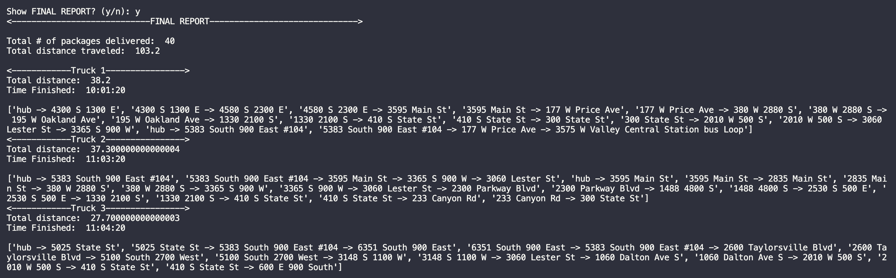
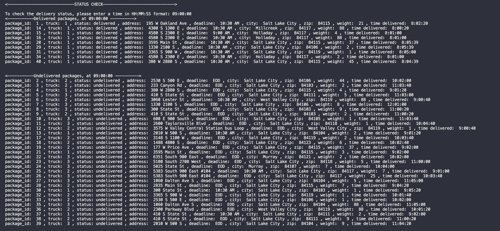
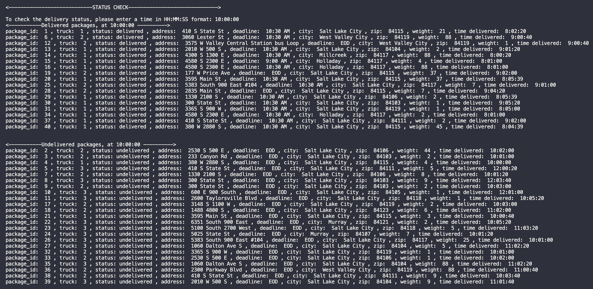
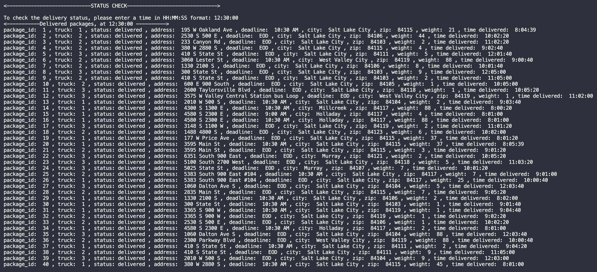
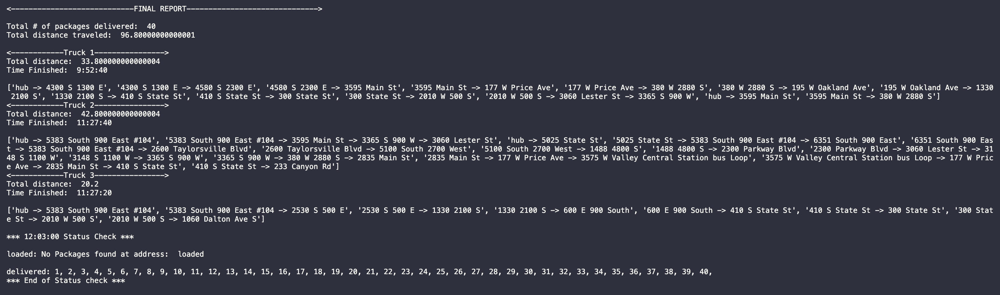

# DeliveryPathFinder

DeliveryPathFinder is an application that I chose to build in for my Data Structures and Algorithms 2 course while attaining my B.S. in CS.  This program provides a shortest path solution for delivering a truck load of packages given their distance from a hub distribution center in Utah.  To solve this my algorithm of choice was implementing [Dijkstra shortest path algorithm](./ShortestPath.py).

## How It Works

- Package data is loaded from Packages.csv
- Distance data is loaded from Distances.csv
- for each package:
  - load packages with a deadline to priority truck queues
  - load packages to specific trucks based on special notes
  - load peer packages that should be delivered together to the same truck queue
  - any packages not marked as Special or Priority are added to an `unloaded_packages` list
- load the rest of the packages optimized by shortest distance:
  - while `unloaded_packages` still contains packages:
    - for each Truck:
      - every Truck starts at the Hub
      - reset the location distance and predecessor values in the `distance_graph` to prep for running Dijkstra's algorithm
      - run Dijkstra's algorithm populating distances and predecessors in `distance_graph` based on the Truck's current location
      - for each package in `unloaded_packages` determine the next closest location
      - do a hash table lookup to determine packages at this stop
      - if the truck has room for all packages at this stop
        - load all those packages into the trucks queue
        - update the trucks current location
- Deliver priority packages to meet deadlines
  - for each truck
    - while the trucks queue is not empty:
      - reset the distance graph to prep for Dijkstra's
      - run Dijkstra's to populate distances from current
      - find the next closest location in the delivery queue
      - update truck's location, distance, and the path taken to get here
      - use a hash table lookup to determine packages at this location, deliver and remove them from the queue
- Deliver rest of packages
  - for each truck
    - while delivery queue still has packages
      - reset the distance graph to prep for Dijkstra's
      - run Dijkstra's to populate distances from current
      - find the next closest location in the delivery queue
      - update trucks location, distance, and the path taken to get here
      - use a hash table lookup to determine packages at this location, deliver and remove them from the queue
    - calculate trucks total time
- Report results to the user

## Algorithm Strengths

- Dijkstra's algorithm can calculate the next shortest point on a graph dynamically based on all the known points on a graph currently.
- Dijkstra's is the best for optimizing on the true shortest distance.

### Alternatives

A greedy algorithm or binary search tree would have worked.

#### Comparison

Dijkstra's algorithm has some greedy properties because the shortest path to all other vertices from the current vertex is re-calculated and is considered optimal at that moment, however may not be the most optimal for a round trip.  A greedy algorithm could be used to find the next closest hop, but may not into account the whole length of the program.  A greedy algorithm would have been better for the round trip shortest path because I could have optimized for the final location to be closest to the hub

A Binary Search tree could have been leveraged by storing each location as a node in the tree and searching based on the next smallest distance.  Because each location in a graph when Dijkstra's stores its predecessor limits storage and search requirements.  To be able to calculate the true shortest path the way Dijkstra's does, a binary search tree would have to be searched at each point and path and the results stored.  This process would have been pretty intensive since it would have to be calculated for each point and path.

## Space-time complexity

A comment was added to each major section of code in the `main()` function in [DeliveryPathFinder.py](./DeliveryPathFinder.py) and after analyzing and combining the complexity of major sections the runtime complexity of the total program comes out to be `O(N^3)`.

## Self Adjusting Data Structures

I went with a chained hash table with a constrained size.  Rather than looping overall packages to find those with the same delivery address or another property, each package is instead stored in a semi-unique bucket index.  The bucket is found by hashing the passed-in key and using the modulo operator to find the remainder after dividing the size of the table.  This has the advantage of potentially speeding up searching, the worst-case is O(N) and the best-case is O(1).   

Unfortunately with only a table size of 40, there is a relatively high chance of collisions and the returned bucket list is NOT always unique.  The bucket results must be checked to ensure they match the original search criteria.

Increasing the size of the table could reduce the number of collisions.  However, it would require much more space and the improvement isn't guaranteed.

The hash table is defined as the class [PackagePropertyTable](PackagePropertyTable.py).  A set of Getter functions can be found in [Hub.py](Hub.py), i.e. `get_packages_by_address`.  Each function corresponds to a type of package property (i.e. `address`) and is used to help remove the burden of loading a list of packages into their respective bucket list. The resultant table is then returned to the caller.  This pattern is implemented


## Other Data Structures and Relationships

The hash table is defined as the class [PackagePropertyTable](PackagePropertyTable.py).  

- package ID number
- delivery address
- delivery deadline
- delivery city
- delivery zip code
- package weight
- delivery status (e.g., delivered, en route)

The following wrapper functions are available with the [Hub](Hub.py) object `get_packages_by_weight`, `get_packages_by_zip`, `get_packages_by_city`, `get_packages_by_id`, `get_packages_by_status`, `get_packages_by_address`, `get_packages_by_arrival` and `get_packages_by_deadline`.  These functions are passed a list of [packages](Package.py) and will group the package objects into the table's bucket lists based on the result of hashing each package's property.  The table is then returned to the caller and its data can be quickly searched using the `read()` function.  The `read()` function can be passed a key, the modulo of the key's hash is used to find the bucket's index in the table and return it.  The bucket is a list of package objects with matching package properties.  This is very useful when you need to quickly find all of the packages that share an `address`, `city`, or another package object property.

The contents of the returned bucket list can be polluted with packages that don't match the desired property key.  This is an expected collision caused by the uniqueness bucket's index.  The hash may be unique, but the remainder may not be.  These collisions are handled by a technique called chaining, where the packages are stored in semi-unique bucket lists.  This subset of packages with a semi-unique property value will be looped over and checked to ensure only packages matching the desired key are returned.

Due to urgency and prioirity at the time, I missed several opportunities to use these lookups that would allow for a far more efficient algorithm.  An improvement would be to an audit and replace any iterations that can be achieved through the hash table's API.  I do demonstrate the use the lookup to make sure each package at a particular address is delivered to that location.  These lookups are used by calling the methods attached to Hub objects: [Hub.py](Hub.py).

The hash table is defined in [PackagePropertyTable.py](PackagePropertyTable.py) and its data can be loaded by calling the Getter functions in [Hub.py](Hub.py).  The Getter functions are implemented in the `main()` function of [DeliveryPathFinder.py](DeliveryPathFinder.py).  The Getters act as an interface for passing a list of packages that will be loaded and indexed by hashing the package property denoted in the name of the method, i.e.: `get_packages_by_status`.  An implementation of a hash table, loaded with packages grouped by their delivery address, can be found online 203.  The returned table is then searched for a bucket list index with a matching address.  The contents of the bucket list are iterated over, checked for collision, and delivered on lines 206-212.

The [PackagePropertyTable.py](PackagePropertyTable.py) holds the definition for the `create`, `delete`, and `read` functions are used in the main body to work with the data stored in a hash table.  The `create` function can be used to append packages to an existing bucket list with a matching index of the hashed key or create a new bucket list if the key doesn't exist yet.  The `delete` function allows the removal of a bucket list of packages based on the passed key.  And the `read` function is used to quickly search the table for a bucket list of packages with a matching key.

Each bucket list for the `PackagePropertyTable` store Package objects.  Each Package object stores all of the following data points as properties:

```
self.package_id = package_id
self.package_weight = package_weight
self.delivery_address = delivery_address
self.delivery_city = delivery_city
self.delivery_zip = delivery_zip
self.delivery_deadline = delivery_deadline
self.delivery_status = 'hub'
self.arrival_time = 0
self.delivery_weight = 0
```

Note: `arrival_time` is equal to delivery time.


#### Comparison

A simple list would require iterating over the entire list to find all objects with a matching property and then iterating over the returned list.  A direct hash table could be used to access an exact matching subset of objects at a hashed index and without any chance for collision giving a complexity of O(1).


#### Hashtable Lookups

For a chained hash table the run time complexity is O(1) in the best-case scenario and O(N) in the worst-case scenario.  This means the performance in the worst-case scenario is linearly affected by the number of packages.  This would be the case if all packages collided and were stored in a single bucket list.  Requiring the bucket list to be looped over N number of times.

#### Hashtable Growth

The hash table grows linearly with the uniqueness of the data fed into it.

#### More Trucks or More Cities?

Lookup would still be O(n) but since cities are unique it would be linear in size.  Trucks wouldn't affect the size since it is the contents of the truck that affects the size not the number of trucks.

## Alternative Data Structures

A simple list, or a direct access hash table.

## Scalability

The current solution is designed to allow for data sets of any size.  The main data structure for storing and retrieving packages is a chained hash table defined as the class `PackagePropertyTable`.  A chained hash table allows for each indexed bucket in the table to be a list of any size.  If a table is keyed based on package addresses, was created from a list of 100 packages and all 100 packages shared the same address, then when the table is loaded each package would append to the same bucket list.  When the Getter functions included in the [Hub](Hub.py) are called a new table is declared and initialized with a size of forty.  To reduce the number of collisions this size of the table should be equal to or greater than the number of packages that it will be used to store.  The table for size for a package list of one hundred should be at least one hundred as well.  If a collision does occur the package will still be appended and stored in the bucket list with packages with a different property value.  The semi-unique and much smaller bucket list will be iterated over by the caller, to prune out any undesired packages.

If the number of packages to be stored in the table increased during the runtime of the program, then the table would require a rehash.  The new package list of increased size could be passed to a modified Getter function that sets the size of the table to the size greater than or equal to the list of packages.

The search performance of the table depends on the uniqueness of the package property data that the table was keyed to and the number of collisions that occur while loading the table.  If the list that is returned containing no collisions in the chained list then the search performance is O(1).  However, if there are one or more collisions in the returned list of packages of N length then they will need to be iterated over for a total of O(N) comparisons.  This allows the chained hash table to perform the same as searching a list, O(N), in the worst-case, but better than a binary search tree in the best case, O(logN).

## Maintainability

The software was built in an object-oriented fashion to help make APIs for each type of object including [Package.py](Package.py), [Hub](Hub.py), [Truck.py](Truck.py), [Location](Location.py), and [PackagePropertyTable](PackagePropertyTable.py).  These objects and their associated APIs help improve re-usability, redundancy, and code maintenance.  Each class can be used to create objects of that class type allowing the methods and properties of the class to be inherited by the object.  If two types of objects require similar functionality then their classes can inherit the functionality from a shared class or interface.  The shared interface can be used to interact with data that is stored/persisted externally like a spreadsheet or database.  Code that is organized around object abstractions is modular and composable meaning that only the abstraction may require a change to make a change to the program rather than each time an action that abstraction would own occurs in the program.  The modular design leads to easier maintenance of code.

Each object's methods and properties are used to store data that describes the object instance state.  An example of this state is the `Package.delivery_status` property which can be interrogated to determine whether the package is still at the hub, being delivered, or already delivered.  

In addition to the object-oriented design, the code is meant to be easy to navigate by using meaningful and easy-to-understand variables or objects.  To help with understanding the flow of the main program each section of functionality has been commented to give the reader context and points of reference.

## Environment

macOS Big Sur 11.1
visual studio code Version: 1.52.1
Python 3.9.1

## Entrypoint

The main program is located in [DeliveryPathFinder.py](./DeliveryPathFinder.py)

## User Guide

The user is prompted for a time with the following format, "HH:MM:SS". The program will then return a list of delivered and undelivered packages at the specified time with the properties described in part F.  Three screenshots show this status check at the given times, below.  

Also, the user is prompted for `Show FINAL REPORT? (y/n):`.  If the user enters `y` the final report is printed, including the total distance traveled by all trucks, the total distance for each truck, and the time each truck finished its deliveries:



Status of all packages at a time between 8:35 a.m. and 9:25 a.m.


Status of all packages at a time between 9:35 a.m. and 10:25 a.m.


Status of all packages at a time between 12:03 p.m. and 1:12 p.m.


Successful Results:



## Improvements

- Iterate over the graph rather than over the packages and then just used the hash tables to look up whether there was a package that needed to be delivered to that location.  This would require a fairly large refactor, but would significantly improve lookups especially as inventory increases.
- Refactor loops to be named recursive functions making it easier to read, update, reason, and communicate about the core algorithm.  Highly recommended if this code were to ever be used in a collaborative environment.
- Standard logging
- Unit tests
- Standardizing client inputs and outputs
- externalize config
- Look into further optimizations to the Dijkstras Shortest Path and other Graph traversal algorithms
- The code could use a clean up by following the SOLID principals

## Support

If you have any questions about this repo or the DeliveryPathFinder application please reach out to my email <a href="mailto:clair.james88@gmail.com?subject=[GitHub]%20DeliveryPathFinder%20Question">clair.james88@gmail.com</a>

## Contributing
Closed
