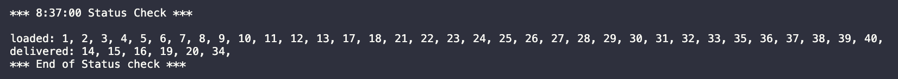
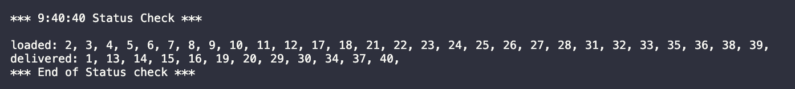
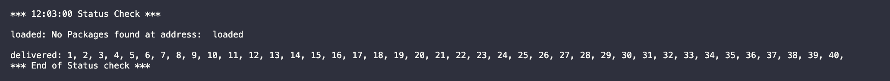

# DeliveryPathFinder

## A. Identify a named self-adjusting algorithm
My algorithm of choice was implementing [Dijkstra shortest path algorithm](./ShortestPath.py).

## B. Write an overview of your program, in which you do the following:

### 1. Explain the algorithm’s logic using pseudocode.

My algorithms logic in psuedocode:

- Package data is loaded from Packages.csv
- Distance data is loaded from Distances.csv
- for each package:
  - load packages with deadline to priority truck queues
  - load packages to specific trucks based on special notes
  - load peer packages that should be delivered together to same truck queues
  - any packages not marked as special or priority are added to an unloaded_packages list
- load the rest of the packages optimized by shortest distance:
  - while unloaded_packages still has packages:
    - for each truck:
      - every truck starts at hub
      - reset the location distance and predecessor values in the distance_graph to prep for running dijkstras algorithm
      - run dijkstras populating distances and predecessors in distance_graph based off the truck current location
      - for each package in unloaded_packages determine the next closest location
      - do a hash table lookup to determin packages at this stop
      - if the truck has room for all packages at this stop
        - load all those packages into the trucks queue
        - update the trucks current location
- Deliver priority packages in order to meet deadlines
  - for each truck
    - while the trucks queue isn't empty:
      - reset the distance graph to prep for dijkstras
      - run dijkstras to populate distances from current
      - find the next closest location in the delivery queued
      - update trucks location, distance, and path taken to get here
      - use a hash table lookup to determine packages at this location, deliver them and remove from queue
- Deliver rest of packages
  - for each truck
    - while delivery queue still has packages
      - reset the distance graph to prep for dijkstras
      - run dijkstras to populate distances from current
      - find the next closest location in the delivery queue
      - update trucks location, distance, and path taken to get here
      - use a hash table lookup to determine packages at this location, deliver them and remove from queue
    - calculate trucks total time
- Report results to the user
### 2. Describe the programming environment you used to create the Python application.

MacOS Big Sur 11.1
visual studio code Version: 1.52.1
Python 3.9.1

### 3.  Evaluate the space-time complexity of each major segment of the program, and the entire program, using big-O notation.

Comments were added to each major section of code in the `main()` function in [DeliveryPathFinder.py](./DeliveryPathFinder.py) and after analyzing and combining the complexity of each major section the runtime complexity of the total program comes out to be `O(N^3)`.

### 4.  Explain the capability of your solution to scale and adapt to a growing number of packages.

The current solution is designed to take in larger data sets both in packages and in locations.  Building around Dijkstras shortest path it will dynamically determine distances based on the data that is input.  This means with enough resources the program could handle any number of packages and locations.  

- TODO: The work clearly describes the algorithm as scalable. A description of how the algorithm adapts to changing numbers of packages could not be found.
  - 
  - Looking for:
    - main DS is the hash table
    - thorough description of how a hash table handles a collision
    - how does current solution handle more than 40 packages
    - how could I scale a hash table (rehashing the table)

  - Important:
    - may only require O(1), in contrast to searching a list O(N), or O(log N) for binary search
    - 
### 5.  Discuss why the software is efficient and easy to maintain.
The software was built in an object oriented fashion to help make apis for each type of object including packages, hub, truck, location, and lookup tables.

- TODO: The submission briefly mentions the programming is object-oriented. A discussion that explains why the software is efficient and why it is considered easy to maintain is not readily evident.
  - 
  - Do I just need to elaborate more on this answer?  I.E. describe why an object oriented design helps by creating chunks of abstracted code that can be defined once and re-used.  And properties that describe and store information on the state of the object.
    - Descriptive variables and functions
    - code that is well-commented
    - low coupling
    - 3 reasons for OOO
### 6.  Discuss the strengths and weaknesses of the self-adjusting data structures (e.g., the hash table).
I chose a direct access hash table over a hashtable with a limited memory constraint.  My original implementation below contrained the table size and used modulo operations to narrow down the results returned.  While this speeds up searching, it is still O(n-1) because while the results are MORE unique they are NOT 100% unique or discrete to the index and still requires a loop over the resultant subset to check if the address matches the desired search criteria.  This is because while the hash is unique the remainder of the hash from %40 is NOT.  The following was my first implementation that swapped out for a more performant direct hash map:

```python
class PackagePropertyTable: 

    def __init__(self, size):
        self.table = []
        self.keys = []
        for i in range(size):
            self.table.append([])

    def create(self, key, value):
        bucket = hash(key) % len(self.table)
        self.table[bucket].append(value)
        self.keys.append(key)

    def read(self, key):
        bucket = hash(key) % len(self.table)
        bucket_list = self.table[bucket]
        if len(bucket_list) > 0:
            for package in bucket_list:
                if package.label != key:
                    bucket_list.remove(package)
            return bucket_list
        else:
            print("No packages found for address, do nothing.")
            return []

    def delete(self, key):
        # key = int(key)
        bucket = hash(key) % len(self.table)
        bucket_list = self.table[bucket]

        if bucket in bucket_list:
            bucket_list.remove(bucket)

```

The weakness of the Direct access hash map is that the memory requirements can be linear to the data it is storing depending on it's uniqueness, making it a potential memory hog.


## C.  Write an original program to deliver all the packages, meeting all requirements, using the attached supporting documents “Salt Lake City Downtown Map,” “WGUPS Distance Table,” and the “WGUPS Package File.”

The main program is located in [DeliveryPathFinder.py](./DeliveryPathFinder.py)

### 1.  Create an identifying comment within the first line of a file named “main.py” that includes your first name, last name, and student ID.

The file is named [DeliveryPathFinder.py](./DeliveryPathFinder.py) And the line has been added.

### 2.  Include comments in your code to explain the process and the flow of the program.


Comments inluded inline
## D. Identify a self-adjusting data structure, such as a hash table, that can be used with the algorithm identified in part A to store the package data.

As explained above I chose a Direct access hash table this can be found here: [PackagePropertyTable.py](PackagePropertyTable.py)

### 1.  Explain how your data structure accounts for the relationship between the data points you are storing.

Because there is hypothetically a fairly limited number of packages and most systems today have decent amounts of memory to allocate, the worst case scenario would be something like 40 keys with 1 package per list, like in the case of package IDs.  However, a direct access hash table requires less of a performance hit at O(1) because it can supply all packages with a particular key in common just by hashing that key.

- TODO: A description of how the hash table works, including the hash function and how collisions are avoided, is not readily evident.
  - 
  - 

## E. Develop a hash table, without using any additional libraries or classes, that has an insertion function that takes the following components as input and inserts the components into the hash table:

- package ID number
- delivery address
- delivery deadline
- delivery city
- delivery zip code
- package weight
- delivery status (e.g., delivered, en route)

I didn't use all of these lookups, though I wish I had rather than unnecessarily iterating over the package lists.  I do use the lookup to make sure each package at a particular address is delivered to that location.  These lookups are used by calling the methods attached to Hub objects: [Hub.py](Hub.py).

- TODO: The submission describes an appropriate hash table implementation in aspect B6. An implementation of the described hash table class could not be found in the code.
  - 
  - link the python file and line numbers,

## F. Develop a look-up function that takes the following components as input and returns the corresponding data elements:

- package ID number
- delivery address
- delivery deadline
- delivery city
- delivery zip code
- package weight
- delivery status (i.e., “at the hub,” “en route,” or “delivered”), including the delivery time

The [PackagePropertyTable.py](PackagePropertyTable.py) holds the definition for the create, delete, and read functions that I use in the main body to work with these data structures.

- TODO: The Look-up Function aspect will be assessed once a complete hash table is in place.
  - 
  - Put the old hashtable, 
## G. Provide an interface for the user to view the status and info (as listed in part F) of any package at any time, and the total mileage traveled by all trucks. (The delivery status should report the package as at the hub, en route, or delivered. Delivery status must include the time.)

The package object is the interface to describe its current status and time of delivery [Package.py](Package.py).  The Truck object is the interface to describe the status of the truck, and it mileage traveled [Truck.py](Truck.py).  And the methods on the Hub object are the interface used to group and lookup packages in a hash table based on their status at a given time throughout the program: [Hub.py](Hub.py)

- TODO: The submission clearly provides code that runs to completion without errors and shows the total mileage traveled by each truck. An interface that allows the user to enter a time to check the status of a package or all packages at a given time is not readily evident.
  - 
  - command line interface that at a minimum allows user to input any time that 
    - use the timestamp on the package to determine its status


### 1.  Provide screenshots to show the status of all packages at a time between 8:35 a.m. and 9:25 a.m.


- TODO: A screenshot for the first status check that shows a list of package Ids that a delivered and not delivered at 8:37 AM is provided. A screenshot with program output to show which truck the packages are loaded on is not readily evident.
  - 
    - Add 

### 2.  Provide screenshots to show the status of all packages at a time between 9:35 a.m. and 10:25 a.m.


- TODO: A screenshot for the second status check that shows a list of package Ids that a delivered and not delivered at 9:40 AM is provided. A screenshot with program output to show which truck the packages are loaded on is not readily evident.
  - 
### 3.  Provide screenshots to show the status of all packages at a time between 12:03 p.m. and 1:12 p.m.

- TODO: A screenshot for the third status check that shows a list of package Ids that a delivered and not delivered at 12:03 AM is provided. A screenshot with program output to show which truck the packages are loaded on is not readily evident.
  - 

## H.  Provide a screenshot or screenshots showing successful completion of the code, free from runtime errors or warnings, that includes the total mileage traveled by all trucks.

## I.  Justify the core algorithm you identified in part A and used in the solution by doing the following:

### 1.  Describe at least two strengths of the algorithm used in the solution.
- Dijkstra's can dynamically calculate shortest the next shortest point on a graph dynamically based on all the known points on a graph currently.
- Dijkstra's is the best for optimizing on true shortest distance.
### 2.  Verify that the algorithm used in the solution meets all requirements in the scenario.
Done
### 3.  Identify two other named algorithms, different from the algorithm implemented in the solution, that would meet the requirements in the scenario.
A greedy algorithm or binary search tree would have worked.
#### a.  Describe how each algorithm identified in part I3 is different from the algorithm used in the solution.
A greedy algorithm would have been better for round trip shortest path because I could have optimized for the final location to be closes to the hub.  Binary Search tree would have been pretty intensive since it would have to be calculated for each point and path.
- TODO: The submission briefly describes the greedy and binary search tree algorithms. A description that compares the greedy and binary search tree algorithms with the implemented algorithm is not observed.
  - 
  - Talk about how dikjstras is different from geedy and binary search tree algorithms, pros and cons.
  - 

## J.  Describe what you would do differently, other than the two algorithms identified in I3, if you did this project again.
I would have iterated over the graph rather than over the packages and then just used the hash tables to look up whether there was a package that needed to be delivered to that location.
## K.  Justify the data structure you identified in part D by doing the following:
### 1.  Verify that the data structure used in the solution meets all requirements in the scenario.
Done
- TODO: The Verification of Data Structure aspect will be assessed once a complete hash table is in place.
  - 
  - 
#### a.  Explain how the time needed to complete the look-up function is affected by changes in the number of packages to be delivered.
O(N) regardless of size since it is a direct access hash table

#### b.  Explain how the data structure space usage is affected by changes in the number of packages to be delivered.
The hash table grows linearly with the uniqueness of the data fed into it.
#### c.  Describe how changes to the number of trucks or the number of cities would affect the look-up time and the space usage of the data structure.
Lookup would still be O(n) but since cities are unique it would be linear in size.  Trucks wouldn't affect the size since it is the contents of the truck that affects the size not the number of trucks.

### 2.  Identify two other data structures that could meet the same requirements in the scenario.
A simple list, or a non-direct access hash table
#### a.  Describe how each data structure identified in part K2 is different from the data structure used in the solution.
A simple list would require iterating over the entire list to find all objects with a matching property and then iterating over the returned list.  Similarly the non-direct hash table could be used to access a smaller subset of objects that can be iterated over to weed out collisions.


## TODO:
- The Original Code aspect will be assessed once revised responses for the Hash Table and Interface task prompts are in place.
  - 
- Additional information about Professional Communication competency can be found in the FAQs.
  - 
  - doublecheck grammar and spelling.


